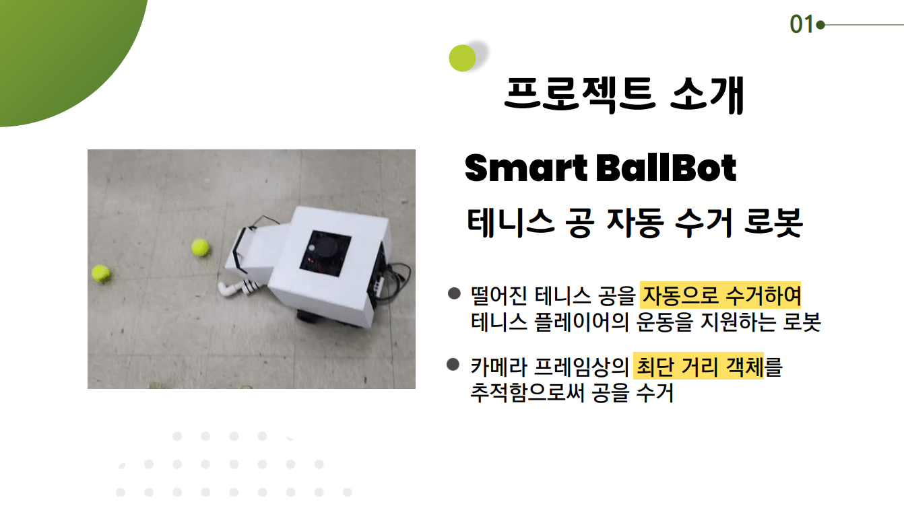
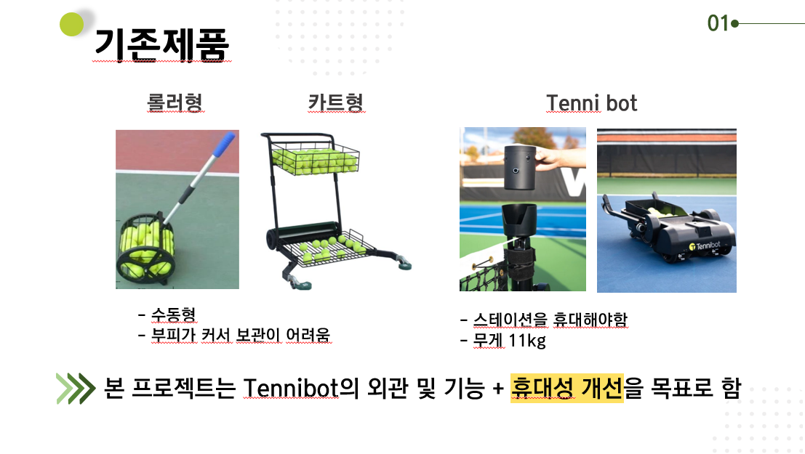
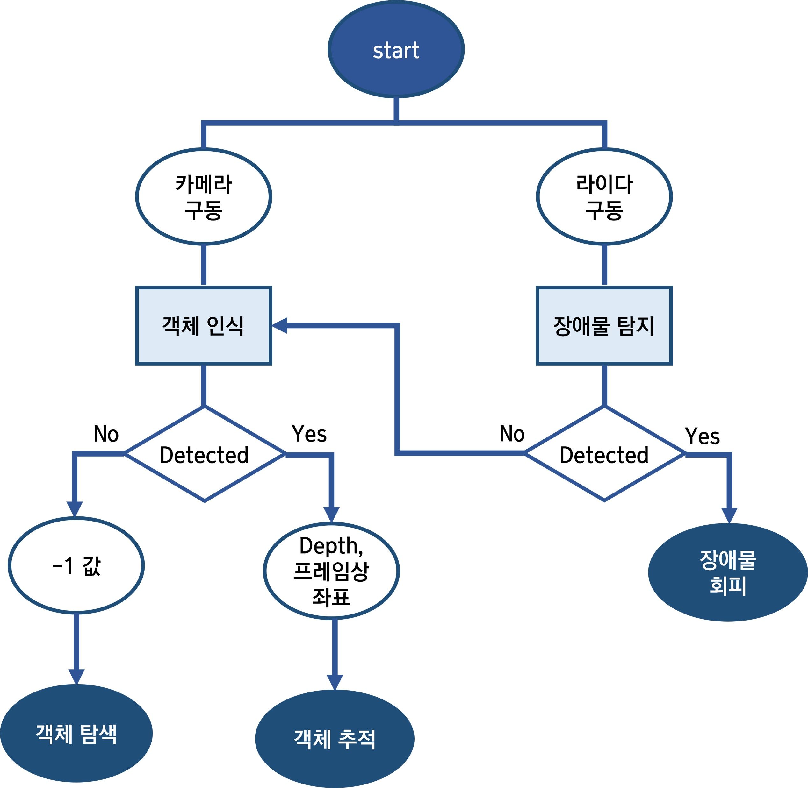
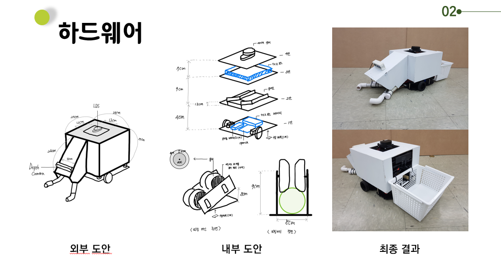

Smart-BallBot
================

<h3> Thank you for inspiring this project, Tennibot. </h3>

------------------------------------------------------------------------------------------
 
 
<h3> [Real driving] <h3>
   
   
 
 　　　 

  
## What is Smart-BallBot?  

- Smart BallBot is an __*automatic tennis ball collection robot*__.  
- The robot could replace the role of 'ball person' picking up a tennis ball that fell to the bottom of the tennis court.  
- This will improve the convenience of tennis players and contribute to preventing the injury of 'ball person'.  

 
   

  
We have created a robot with improved __*portability*__ than Tennibot, a representative automatic tennis ball collection robot.  

  
   

### This project completed autonomous driving through the following functions.

- __*Object detection*__ through *Yolov4*.
- __*Object tracking*__ through the distance value of depth camera(intel realsense D435) and object detection.
- __*Search driving*__ function that is implemented when no object exists on the frame.
- __*Avoiding obstacles*__ through lidar values (if obstacles is a wall or if obstacles is not a wall)  
   

 
## development environment  
 |__*Hardware*__|__*Software*__|
|:---:|:---:|
|turtlebot3 burger|Ubuntu 18.04|
|Nvidia jetson tx2|jetpack 4.6|
|intel realsense depth camera D435|Ros melodic|
|Arduino RC car moter wheel|opencv 4.4|
|pvc pipe|c++|
|plywood|python2.7|

## FlowChart
  
  
 
 
## Hardware Architecture
 
  
   

 각 기능 코드 설명 기술 필요  
 

[weight, data, ppt, report link](https://drive.google.com/drive/folders/1Z5RPslZzYfOkavRUon8S_9rod0F4WjUD?usp=sharing)
