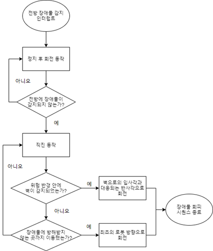

Smart-BallBot
================

<h3> Thank you Tennibot for inspiring this project. </h3>

------------------------------------------------------------------------------------------
 
 
<h3> [Real driving] <h3>
   
   
 
 　　　 

  
## What is Smart-BallBot?  

- Smart BallBot is an __*automatic tennis ball collection robot*__.  
- The robot could replace the role of 'ball person' picking up a tennis ball that fell to the bottom of the tennis court.  
- This will improve the convenience of tennis players and contribute to preventing the injury of 'ball person'.  

 
   

  
We have created a robot with improved __*portability*__ than Tennibot, a representative automatic tennis ball collection robot.  

  
   

### This project implemented autonomous driving through the following functions.

- __*Object detection*__ through *Yolov4*  
 1. It uses about 11,000 tennis ball labeling data. (Unlabeled round object data approximately 3,000 sheets)
 2. yolov4-tiny, yolov4, yolov5s were implemented, and yolov4 was selected as a result of performance comparison.
 3. code : vision.cpp
- __*Object tracking*__ through the distance value of depth camera(intel realsense D435) and object detection.
 1. The in-frame object information detected by "vision.cpp" is transmitted to set an "angular.z".(Frame : width=640, heigh=480)
 2. When the center value of the detected object is greater than 220 and less than 420 on the frame, Set angluar.z = 0. (straight forward)
 3. Otherwise, set angular.z between -1 and 1 value through the cosin function.
 4. code : vision.cpp, main.py, chase_the_ball.py
- __*Search driving*__ function that is implemented when no object exists on the frame.
 
  
   
 1. Using the angle of reflection  
 2. code : main.py, chase_the_ball.py  
- __*Avoiding obstacles*__ through lidar values (There are two cases where the obstacle is a wall and not a wall.) 
 
  
     
 1. code : ob_avoid.py, chase_the_ball.py
   

 
## development environment  
 |__*Hardware*__|__*Software*__|
|:---:|:---:|
|turtlebot3 burger|Ubuntu 18.04|
|Nvidia jetson tx2|jetpack 4.6|
|intel realsense depth camera D435|Ros melodic|
|Arduino RC car moter wheel|opencv 4.4|
|pvc pipe|c++|
|plywood|python2.7|

## Structure
  
<h4> [FlowChart]   [Node/Topic Graph] </h4>

 
 
 

## Hardware Architecture
 
  
   

 

[weight, data, ppt, report link](https://drive.google.com/drive/folders/1Z5RPslZzYfOkavRUon8S_9rod0F4WjUD?usp=sharing)
